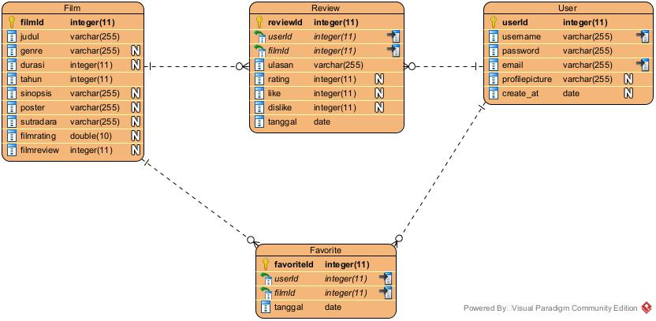

**About**
JejakSinema is a web-based platform that allows users to keep track of the movies they have watched. Through JejakSinema, users can easily log their viewing history, leave personal reviews visible to the community, and share their thoughts on any film. Additionally, the platform enables users to create personalized watchlists, discover new movies, and explore reviews from other community members.

**Entity Relationship Diagram**

**Prerequisites**
Before starting, ensure that you have *XAMPP* and *Node.js* installed on your system.

**A. Database Setup**
1. Open the *XAMPP Control Panel* and click *"Start"* on both the *Apache* and *MySQL* modules.
2. Click the *"Admin"* button next to MySQL to open `localhost/phpmyadmin` in your browser.
3. Create a new database named `jejaksinema`.
4. Configure the tables and their attributes according to the provided Entity Relationship Diagram.
5. Insert some dummy data into the tables for testing purposes.

**B. Backend Setup**
1. Navigate to the `server` directory: `cd server`
2. Install the required dependencies: `npm install express cors mysql2`
3. Start the backend server: `node index.js`

**C. Frontend Setup**
1. Navigate to the project directory.
2. Install the necessary `node_modules`: `npm install`
3. Start the React development server: `npm run dev`
